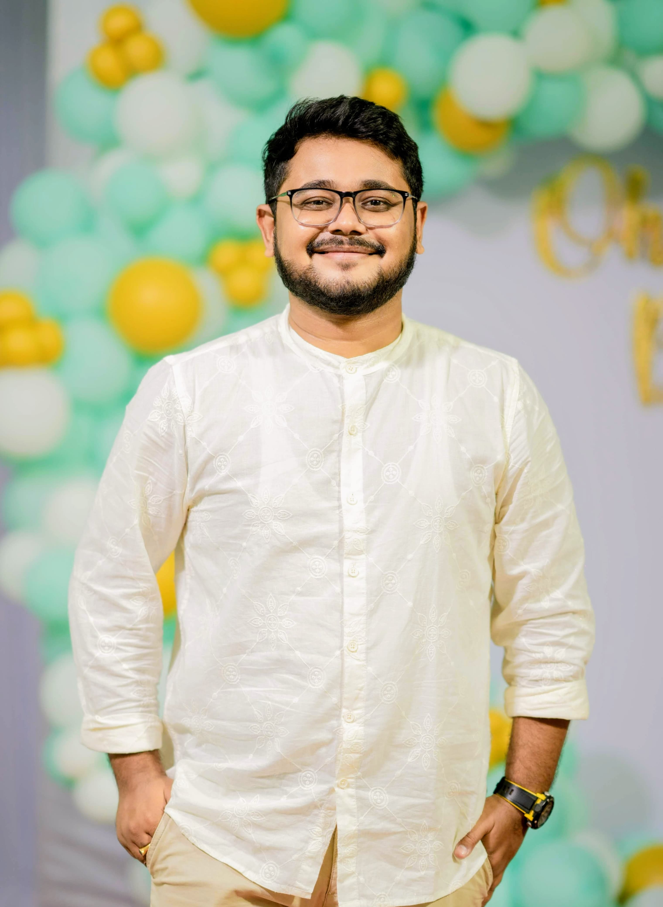

<nav style="text-align:center; margin-bottom: 2rem;">
  <a href="/index.html" style="margin: 0 15px;">🏠 Home</a>
  <a href="/about.html" style="margin: 0 15px;">👤 About</a>
  <a href="/projects.html" style="margin: 0 15px;">🛠 Projects</a>
</nav>

  
  <h1 style="animation: slideIn 1s ease-out;">👋 Hi, I'm Rudranil</h1>

I'm a Software Engineer passionate about building scalable, real-world applications...

🎯 **Looking to contribute to impactful, cutting-edge tech projects.**

- 🏆 Gold Medalist – Master’s in Computer Engineering  
- 💼 Freelance Developer since 2022  
- 🧠 Fluent in Python, JS, Scala, Java, GraphQL  
- 🔧 Worked with Flutter, React, Frappe, Firebase, Docker, and more

📬 Let's connect:  
[LinkedIn](https://www.linkedin.com/in/rudranildray) | [GitHub](https://github.com/rdr6000)  
📍 Vadodara, India | 📞 +91 63514 35215 | ✉️ rdr6000@gmail.com

  <a href="assets/Rudranil_Datta_Ray_CV.pdf" target="_blank" style="padding: 10px 20px; background: #0366d6; color: white; text-decoration: none; border-radius: 5px; margin-right: 10px;">📄 View CV</a>
  <a href="assets/Rudranil_Datta_Ray_CV.pdf" download="Rudranil_Datta_Ray_CV.pdf" style="padding: 10px 20px; background: #28a745; color: white; text-decoration: none; border-radius: 5px;">💾 Download CV</a>

